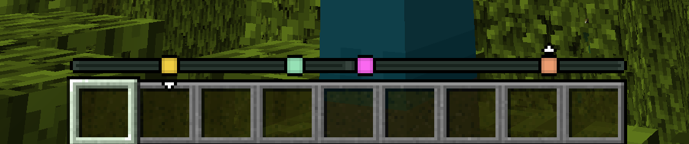
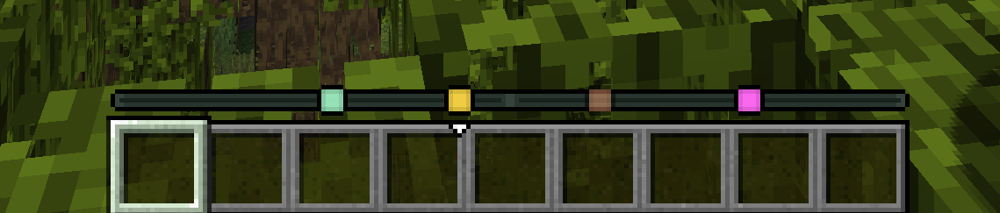
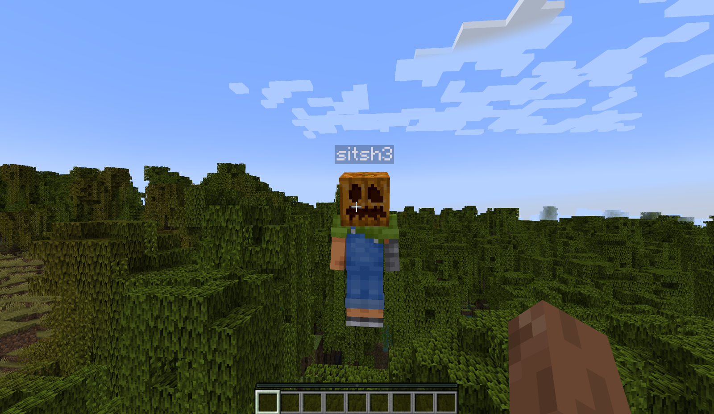

# Player Locator Plus

Track other players' locations on your experience bar like a compass!

  

## Marker colors

Each player's color is determined randomly by their UUID.
You cannot change your UUID (unless you're playing in offline mode); therefore,
it's impossible to change your marker color.

## Distance fade

When a player is *very* far away, their marker starts to fade:

## Disappearing

There are three ways to hide from the player locator:
1. Crouching
2. Wearing a carved pumpkin
3. Having the invisibility effect

## Configuration

The config is available at `config/player-locator-plus.toml`.
You can also access the configuration screen with Mod Menu.

Server parameters:

- `sendDistance`: Whether to send distance information along with the direction information.
  There's basically no point in settings this to `false`, as players can still easily
  triangulate the exact location of others even without knowing the distance.
  However, it is harder with this option on, especially if you consider that other players
  move.
  Default: `true`
- `maxDistance`: The maximum distance at which other players are visible on the compass.
  Default: `0` (unlimited)
- `ticksBetweenUpdates`: How many ticks apart are the compass updates.
  The less, the smoother the movements of faraway players are.
  Close players (inside the entity render distance) do not depend on this parameter as much.
  Default: `10` (two times per second)
- `sneakingHides`: Whether sneaking hides players from the locator. Default: `true`
- `pumpkinHides`: Whether wearing a pumpkin (or any other `gaze_disguise_equipment`) hides
  players from the locator.
  Default: `true`
- `invisibilityHides`: Whether being invisible hides players from the locator. Default: `true`

Client parameters:

- `fadeMarkers`: Fade markers of faraway players. Default: `true`
- `showHeight`: Show little arrows above/below a marker if the height difference is significant.
  Default: `true`

## Acknowledgements

Originally introduced in Minecraft: Bedrock Edition Preview
[here](https://www.minecraft.net/en-us/article/test-the-new-player-locator-bar),
covered by Phoenix SC.

## License

Player Locator Plus is licensed under the GNU General Public License Version 3 or later.
